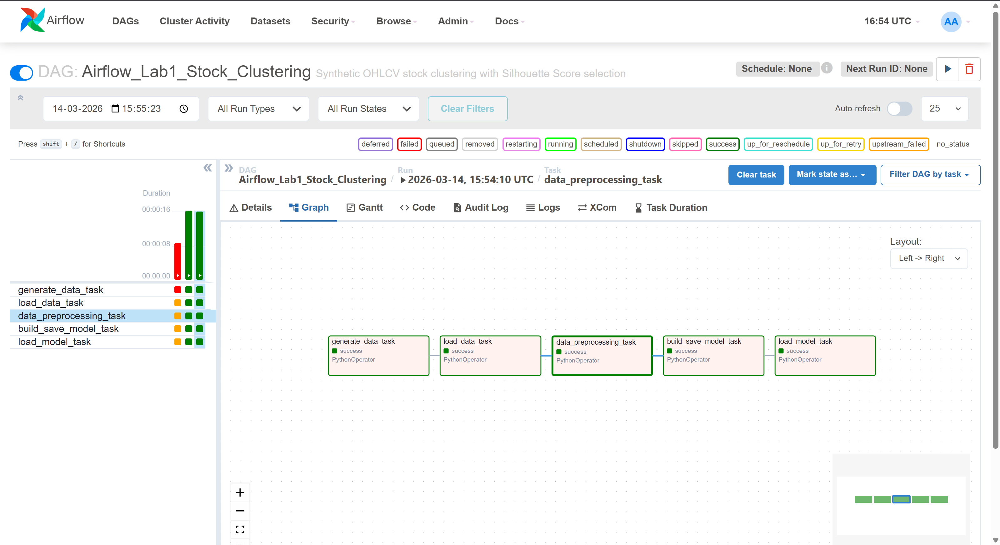
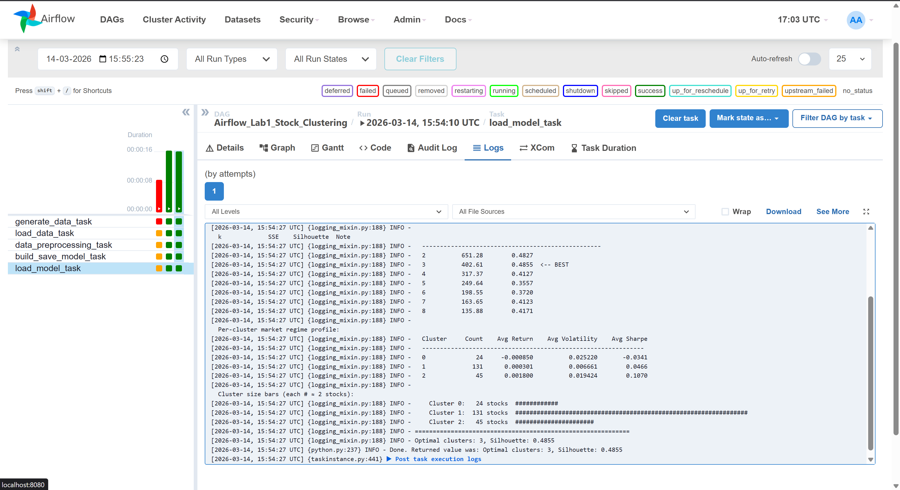

# Stock Market Clustering - Airflow Lab 1
## MLOps Course | Northeastern University

## Overview
An Apache Airflow DAG pipeline that performs KMeans clustering on synthetic OHLCV (Open, High, Low, Close, Volume) stock market data to identify hidden market regimes among 200 simulated stocks over 252 trading days.

## Modifications from Original Lab
| Component | Original Lab | This Version |
|---|---|---|
| Dataset | Manual `file.csv` | Synthetic OHLCV — 200 stocks, 252 trading days |
| Features | Generic numeric columns | `daily_return`, `volatility`, `avg_volume`, `price_range`, `sharpe_approx` |
| Model Selection | Elbow method (kneed) | Silhouette Score |
| DAG Tasks | 4 tasks | 5 tasks (`generate_data_task` added) |
| Output | Prints optimal k | Full market-regime cluster dashboard |
| Model file | `model.sav` | `stock_model.sav` |

## DAG Pipeline
```
generate_data_task → load_data_task → data_preprocessing_task → build_save_model_task → load_model_task
```

### Task Descriptions
1. **generate_data_task** - Generates synthetic OHLCV data for 200 stocks using geometric Brownian motion across 4 hidden market regimes (growth, defensive, volatile, low-vol)
2. **load_data_task** - Loads the generated CSV into a DataFrame
3. **data_preprocessing_task** - Standardises all features using StandardScaler (zero mean, unit variance)
4. **build_save_model_task** - Trains KMeans for k=2 to 8, selects best k using Silhouette Score, saves best model to disk
5. **load_model_task** - Loads the saved model and prints a full cluster analysis dashboard including per-cluster market regime profile

## DAG Graph


## Cluster Dashboard Output


## Results
- **Optimal clusters: 3**
- **Best Silhouette Score: 0.4855**
- Clusters represent distinct market regimes based on return, volatility, and Sharpe ratio profiles

## Project Structure
```
Lab_1/
├── dags/
│   ├── data/               ← auto-generated stock CSV
│   ├── model/              ← saved KMeans model
│   ├── src/
│   │   ├── __init__.py
│   │   └── lab.py          ← all task functions
│   └── airflow.py          ← DAG definition
├── logs/
├── plugins/
├── config/
├── .env
└── docker-compose.yaml
```

## Setup & Run
1. Install **Docker Desktop** and keep it running
2. Clone this repo
3. Run `docker compose up airflow-init`
4. Run `docker compose up`
5. Go to `localhost:8080` (login: `airflow2` / `airflow2`)
6. Trigger **`Airflow_Lab1_Stock_Clustering`** DAG
7. Check logs of `load_model_task` for cluster dashboard output

## Tools Used
- Apache Airflow 2.9.2
- Docker & Docker Compose
- scikit-learn (KMeans, Silhouette Score, StandardScaler)
- pandas, numpy
